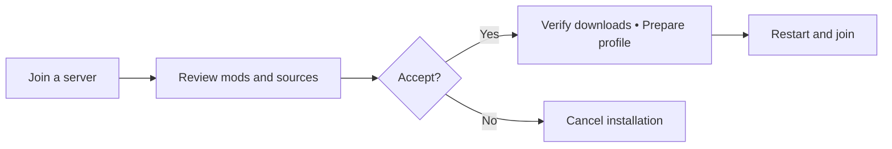

# NeoSync

Review the mods. Prepare a profile. Join the server.

[](https://github.com/enderliker/NeoSync/releases/tag/NeoSync-0.1.0-beta.4-neoforge-21.1.252)
[](https://github.com/enderliker/NeoSync/actions/workflows/build-prs.yml)
[](https://www.minecraft.net/about-minecraft)
[](docs/CONTRIBUTING.md)
[](LICENSE.txt)

[Installation](#installation) · [Usage](#usage) · [Contribute](#contribute)

## Installation

With **Java 21** installed, [download the beta.4 installer](https://github.com/enderliker/NeoSync/releases/download/NeoSync-0.1.0-beta.4-neoforge-21.1.252/NeoSync-0.1.0-beta.4-neoforge-21.1.252-installer.jar)
and run it from your download directory:

```sh
java -jar NeoSync-0.1.0-beta.4-neoforge-21.1.252-installer.jar
```

Run Minecraft **1.21.1** once first, then choose **Install client**. Follow the
[launcher instructions](docs/neosync/launchers.md) to select the installed version
or configure Prism. For a dedicated server in a new directory:

```sh
java -jar NeoSync-0.1.0-beta.4-neoforge-21.1.252-installer.jar --install-server ./neosync-server
```

NeoSync is an open-source fork of [NeoForge](https://github.com/neoforged/NeoForge)
for **Minecraft Java Edition 1.21.1**. It helps players install the exact mods a
server requires through informed consent, verified downloads, and a separate
game directory for each server.

Install NeoSync on both the client and the server. The administrator selects the
required client files and their sources; the player reviews and accepts the set
before installation.

> [!IMPORTANT]
> NeoSync is a beta for Minecraft 1.21.1. Modrinth is the only provider.
> The administrator panel, isolated updates, verified recovery and Prism restart
> integration are implemented. See the [validation matrix](docs/neosync/phase-7.md)
> for the exact tested builds, platforms and remaining limits.

<details>
<summary>Download formats and release notes</summary>

## Downloads

Get the beta installer from [GitHub Releases](https://github.com/enderliker/NeoSync/releases).
Release names include both versions, for example
**`NeoSync-0.1.0-beta.4-neoforge-21.1.252`**.

Download the **`-installer.jar`** for either a client or a dedicated server. The
same installer supports both; a separate universal JAR is not a standalone game
or a mod to put in `mods`. Release assets include SHA-256 checksums and source
information. Follow the [client and server installation guide](docs/neosync/releases.md).

These are experimental prereleases. Use separate test directories and read the
release notes for the actual validation results and remaining limitations.
The [beta.4 prerelease](https://github.com/enderliker/NeoSync/releases/tag/NeoSync-0.1.0-beta.4-neoforge-21.1.252)
adds configurable HTTP or HTTPS for player synchronization and the administrator
panel, with HTTPS as the default. It refreshes the panel's logo and colors and
retains the NeoForge 21.1.252 fixes, Prism restart and profile recovery.
CurseForge remains removed. Restricted hosting remains available for eligible administrator-authored mods.

</details>

## Usage



- Discover the server's required mods before gameplay login.
- Review exact files, sources and changes before accepting downloads.
- Resolve Modrinth files and verify provider hashes plus the server's SHA-256.
- Prepare isolated profiles and recover an earlier revision.
- Export Prism instances with pre-launch verification and restart handoff.
- Select client requirements through the HTTPS administrator panel.

## How it works

1. **Connect.** NeoSync discovers a compatible server's requirements before
   gameplay login and compares them with the current profile.
2. **Review.** See mod names, versions, sources, sizes, and changes. Accept the
   installation and the additional warning for unverified sources, or cancel.
3. **Prepare.** NeoSync downloads the approved files, verifies their hashes and
   metadata, and prepares a new isolated revision. Your regular mod directory
   stays untouched.
4. **Activate and join.** Prepare a Prism instance and choose **Close and launch**,
   or select the displayed game directory manually in a supported launcher.
   Review the refreshed server requirements before reconnecting.

You can postpone activation and leave the profile prepared for later.

<details>
<summary>Detailed capabilities and validation</summary>

## What works today

| Capability | Current behavior |
| --- | --- |
| Administration | HTTPS panel at `https://MACHINE-IP:6742`, generated private password, explicit client-file selection and restart-to-apply configuration. See [setup](docs/neosync/administration.md). |
| Discovery | Retrieves a bounded HTTPS manifest before gameplay login and reports missing or incompatible requirements. |
| Consent | Binds acceptance to the exact reviewed files and sources. Unverified-source warnings default to **No, cancel**. |
| Downloads | Uses configured direct HTTPS URLs or restricted server hosting, with destination restrictions, transfer limits, and SHA-256 verification. |
| Provider resolution | Resolves exact Modrinth files before review and checks both provider and manifest hashes. Modrinth is the only provider. |
| Server hosting | Serves only explicitly declared administrator-authored mods unique to that server through a bounded HTTPS snapshot service. |
| Preparation | Inspects JAR metadata without executing it and prepares a new revision while preserving existing profiles. |
| Launcher support | Prism instance export and restart handoff, with pre-launch verification. Manual installed-version instructions for SKlauncher and Minecraft Launcher. See [launchers](docs/neosync/launchers.md). |
| Profile recovery | Reviews and verifies an earlier revision before selecting it; preserves the running game and all previous revisions. |
| Manual activation | Shows the exact game directory to select in the launcher; checks the selected profile and offers reconnection after restart. |

Current validation and release limitations are recorded in [Phase 7](docs/neosync/phase-7.md).
Historical alpha acceptance remains in [Phase 3](docs/neosync/phase-3.md),
[Phase 4](docs/neosync/phase-4.md), and [Phase 5](docs/neosync/phase-5.md).

</details>

## Contribute

Bug reports, focused fixes, and reproducible compatibility results are welcome
through this repository's [issues](https://github.com/enderliker/NeoSync/issues)
and pull requests. Include the NeoSync build, operating system, launcher, mod set,
and relevant logs with credentials removed.

Start with [CONTRIBUTING.md](docs/CONTRIBUTING.md). All project code,
documentation, and user-facing text are written in English. For work on another
Minecraft version, see [PORTING.md](docs/PORTING.md).

Read the [Code of Conduct](CODE_OF_CONDUCT.md). Report vulnerabilities privately
using [SECURITY.md](SECURITY.md). Release summaries are in [CHANGELOG.md](CHANGELOG.md).

## Reference

[Setup guide](docs/neosync/phase-3.md#server-configuration-and-manual-activation) ·
[Documentation](docs/README.md) · [Roadmap](AGENTS.md#roadmap-and-exit-criteria) ·
[Contributing](docs/CONTRIBUTING.md)

<details>
<summary>Build from source and administrator setup</summary>

## Build from source

Use **JDK 21** and the included **Gradle 8.13 wrapper**. Make sure `JAVA_HOME`
points to JDK 21 before running:

```bash
git clone https://github.com/enderliker/NeoSync.git
cd NeoSync
./gradlew setup
```

Setup prepares the Minecraft development sources and downloads dependencies;
the first run can take some time. On Windows, use `gradlew.bat`.

- **Developers:** follow the [contribution guide](docs/CONTRIBUTING.md) for IDE
  setup, checks, and the Minecraft patch workflow.
- **Server administrators:** open `https://MACHINE-IP:6742` and read the generated
  password locally from `config/neosync-admin/password.txt`. Select the client
  files and restart the server to apply them. Follow the
  [administrator guide](docs/neosync/administration.md) for TLS identity,
  public HTTPS configuration, and restricted hosting.
- **Testing the full flow:** use the [installed-build acceptance harness](tests/neosync/acceptance/README.md)
  to reproduce installation, activation, and joining in a controlled environment.

</details>

<details>
<summary>Compatibility and version identifiers</summary>

## Compatibility and build

| Component | Current version | What it means |
| --- | --- | --- |
| Minecraft Java Edition | **1.21.1** | The Minecraft version targeted by this branch. |
| NeoForge base build | **21.1.252** | The platform build used by NeoSync; mods must be compatible with this NeoForge/Minecraft combination. |
| NeoSync source identifier | **0.1.0-beta.4** | Configurable HTTP/HTTPS and updated administrator panel. |
| Published NeoSync release | **0.1.0-beta.4** | Earlier prereleases remain available with their own validated artifacts. |
| Synchronization protocol | **1 (HTTPS), 2 (HTTP)** | Discovery capability versions; manifest schema remains 1. Beta.3 supports HTTPS protocol 1. |
| Java | **21** | Required for running and developing this build; use a JDK for development. |
| Gradle wrapper | **8.13** | Included in the repository; no separate Gradle installation is needed. |

The current installation flow requires the client's NeoSync and NeoForge versions
to match those declared by the server. Both sides need NeoSync's synchronization
code; installing ordinary NeoForge alone does not provide it. These
versions do not guarantee compatibility with every mod or launcher.

The values come from [gradle.properties](gradle.properties), the
[NeoSync manifest implementation](src/main/java/net/neoforged/neoforge/neosync/protocol/SyncManifest.java),
and the [wrapper configuration](gradle/wrapper/gradle-wrapper.properties).
When reporting a problem, include the release name or Git commit as well as
these versions. Published releases are pinned to a specific source commit.

</details>

<details>
<summary>Provider source handling</summary>

## Provider source handling

Modrinth is the only supported provider. Use `resolveProviders: true` for exact
SHA-512 lookup of a selected server JAR. Clients independently review its identity
and verify both provider and manifest hashes. Configured direct HTTPS downloads
and restricted hosting of administrator-authored mods remain available.

CurseForge and browser imports have been removed from current development. Old
profiles using that provider are rejected and left intact; prepare a new revision
with a supported source. Published alpha.4 binaries and historical validation
records are unchanged. See [Phase 5](docs/neosync/phase-5.md).

Automatic downloads still require review and consent. A provider failure never
authorizes rehosting third-party mods or silently changing the approved source.

</details>

<details>
<summary>Trust, isolation and limitations</summary>

## Trust and isolation

The server proposes files; **the player decides what to install**. A changed file
set or source requires new review. Failed or canceled preparation preserves the
existing installation.

HTTPS and matching hashes establish transport identity and byte consistency;
they do not prove that a mod is trustworthy. Separate game directories organize
mods and data, but **are not a sandbox**: accepted mods run with Minecraft's
permissions. Generated Prism revision instances verify the mod inventory before FML starts.
Other launch routes verify after mod loading. Neither check is a sandbox or a
defense against an attacker who controls the local launcher and its records. Read the
[security requirements](AGENTS.md#security-rules) and
[current limitations](docs/neosync/phase-3.md#acceptance-limits-and-next-work).

</details>

## Upstream and license

NeoSync is maintained independently and builds on
[NeoForge](https://github.com/neoforged/NeoForge). Existing package names and
development tooling reflect that origin. The
[NeoForge documentation](https://docs.neoforged.net/) remains useful for its APIs;
NeoSync-specific support belongs in this repository.

Licensed under **LGPL-2.1-only**, except where individual files state otherwise.
Upstream copyright and license notices remain applicable. See
[LICENSE.txt](LICENSE.txt) and the [licensing notes](README-LICENSE.md).
