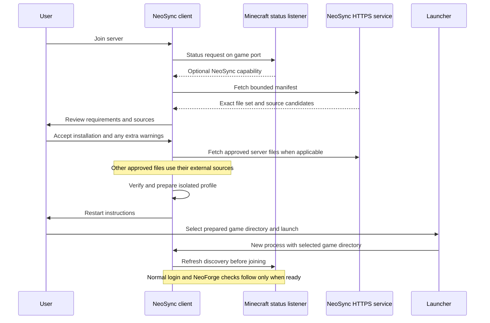

# Phase 1: design and feasibility

Status: design and source investigation completed. This document records the
Phase 1 findings; see [Phase 2](phase-2.md) for the implemented discovery subset
and current validation. Profile selection and launcher integration remain future
work. This investigation did not establish a successful multiplayer session or
launcher smoke test.

The baseline is commit `6c69a6559056e7781980c3f4fc0ae40147f1bdf8`, Minecraft 1.21.1,
FancyModLoader (FML) 4.0.44, ModLauncher 11.0.5, and Java 21. See
[gradle.properties](../../gradle.properties) for dependency versions. This review
inspected repository sources, the pinned loader source archives, and Mojang's
1.21.1 client bytecode and mappings. No Minecraft code was executed.

## Decisions

1. Discover NeoSync through an optional field in Minecraft's status response,
   before creating the gameplay login connection. Retrieve a bounded manifest
   over HTTPS, independent of mod channel negotiation.
2. Keep existing NeoForge compatibility checks. A reviewed manifest describes
   preparation requirements; it never authorizes bypassing channel or registry
   checks.
3. Identify downloads by file hash, with a file-to-mod relationship that supports
   multiple mod IDs in one JAR. Do not infer client requirements from the server's
   entire mod directory or dependency side flags alone.
4. Use an isolated game directory per server profile, selected before ModLauncher
   and FML start. Initially activate it through the launcher's game-directory
   setting and a manual restart.
5. Use normal HTTPS certificate and hostname validation for version 1. Keep server
   identity and consent records locally. Do not introduce custom signing or claim
   that the unauthenticated status response authenticates a server.
6. Make certificate configuration and an HTTPS port or reverse proxy an explicit
   server requirement for the initial protocol. LAN certificate enrollment and
   automatic launcher restart need separate validation before support is claimed.

The detailed contract is in [protocol-v1.md](protocol-v1.md), with a
[manifest schema](manifest.schema.json) and [example](examples/manifest.json).
These contracts guide the implementation. Phase 2 adds the manifest endpoint;
artifact downloads and installation remain unimplemented.

### Component boundaries

Keep these concerns separate when implementing the design. They describe logical
boundaries, not a requirement to create a Gradle module for each component:

| Component | Responsibilities | Dependencies |
| --- | --- | --- |
| Protocol model and validation | Bounded decoding, manifest rules, identity normalization, and digest calculation | No client screens or server lifecycle |
| Client join coordinator | Discovery, requirement comparison, consent state, cancellation, and connection continuation | Protocol model and small Minecraft hooks |
| Client profile store | Cache verification, staging, local consent records, locks, and revision publication | Filesystem and protocol model |
| Server inventory and service | Client selection, immutable snapshots, status advertisement, HTTPS routes, and quotas | Server lifecycle and protocol model |
| Source resolver | Exact provider identity and approved source candidates | Destination policy and provider integrations, starting in Phase 5 |
| Launcher integration | Profile activation and eventual restart | Local prepared records; no server-supplied process arguments |

Shared runtime code must not reference client-only Minecraft classes on a
dedicated server. Keep existing upstream API namespaces stable and use `neosync`
for new protocol and resource identifiers. Establish fork-owned distribution
coordinates before publishing an installer; existing upstream coordinates are
not a NeoSync release destination.

## Integration evidence

| Finding | Evidence | Consequence |
| --- | --- | --- |
| Status and login use different handshake branches | Mojang `ServerHandshakePacketListenerImpl.handleIntention`; the status branch installs `ServerStatusPacketListenerImpl`, while login installs `ServerLoginPacketListenerImpl` | A status request reaches no mod negotiation and needs no installed server mods |
| The status format already has a NeoForge extension | [ServerStatus patch](../../patches/net/minecraft/network/protocol/status/ServerStatus.java.patch), `isModded` and `CODEC` | Add an optional `neosync` capability while preserving existing constructors and fields |
| Status JSON has a cached serialization path | [MinecraftServer patch](../../patches/net/minecraft/server/MinecraftServer.java.patch), `buildServerStatus` and `resetStatusCache`; [status packet patch](../../patches/net/minecraft/network/protocol/status/ClientboundStatusResponsePacket.java.patch) | Publish capability and manifest digest as one snapshot and invalidate cached status when that snapshot changes |
| Joining has a central client entry point before its connector thread | Mojang `ConnectScreen.startConnecting` and `connect`; [existing patch](../../patches/net/minecraft/client/gui/screens/ConnectScreen.java.patch) | Add a small asynchronous preparation hook before the existing connector starts |
| Channel negotiation precedes configuration tasks | [server configuration patch](../../patches/net/minecraft/server/network/ServerConfigurationPacketListenerImpl.java.patch), `startConfiguration`, `handleCustomPayload`, `handlePong`, and `runConfiguration` | A normal registered configuration task is too late to solve missing required channels |
| Missing required channels can disconnect immediately | [NetworkRegistry](../../src/main/java/net/neoforged/neoforge/network/registration/NetworkRegistry.java), `initializeNeoForgeConnection` | Do not implement discovery as an ordinary negotiated mod payload |
| Registry and configuration synchronization happen later | [ConfigurationInitialization](../../src/main/java/net/neoforged/neoforge/network/ConfigurationInitialization.java) | Preserve this stage after preparation and restart |
| Mods load before the multiplayer UI | [Minecraft patch](../../patches/net/minecraft/client/Minecraft.java.patch) and [ClientModLoader](../../src/main/java/net/neoforged/neoforge/client/loading/ClientModLoader.java), `begin` and `loadingComplete` | Downloading a JAR cannot make it available to the running session |
| FML is an external dependency | [NeoForge build](../../projects/neoforge/build.gradle), `net.neoforged.fancymodloader:loader` | A late change to `Minecraft.gameDirectory` cannot redirect prior mod discovery |
| A JAR can contain multiple mods; URLs are informational | [ModListScreen](../../src/main/java/net/neoforged/neoforge/client/gui/ModListScreen.java), `getOwningFile().getMods()` and `displayURL`; FML `IModInfo` and `IModFileInfo` | Counts of files and mods differ; metadata URLs do not establish a download source |

### Connection sequence



Phase 2 stops after displaying requirements. Downloads and profile activation
start in Phase 3; server file hosting starts in Phase 4.

### Client hook behavior

Keep vanilla's duplicate-connection guard and transition out of the previous
world. Before starting the connector thread, hand the join attempt to a NeoSync
coordinator. Carry the original address, parent screen, server data, and join
context in that attempt. Network and disk work must not block the render thread;
apply screen changes on the client thread.

The coordinator owns cancellation and a single-use continuation to the original
connection routine. Avoid recursively invoking the intercepted entry point or
using a global bypass flag. Late callbacks from a canceled attempt must not
change screens, download files, or connect to a different server.

Server-list pings may display a capability indicator, but must not fetch manifests
for every visible server. Fetch on an explicit join attempt, including Direct
Connect. Refresh discovery even when a list ping supplied cached information.
Quick Play, server transfers, and connection paths used by third-party mods need
coverage before support is claimed. A transfer must not inherit the previous
server's consent. In-session backend reconfiguration is outside version 1; it
must not trigger installation inside the existing gameplay connection.

No capability means normal NeoForge connection behavior. A failed status request
allows an explicitly labeled ordinary connection attempt without synchronization.
If a capability is present but its manifest is invalid or incompatible, stop
synchronization and explain the error; never silently bypass a known mismatch.

### Server hooks and inventory

Prepare and validate an immutable snapshot outside the server tick and request
handlers. Read metadata and hash regular JAR files without instantiating mod
classes for analysis. The running server may already have executed its own mods;
that does not justify executing code while inspecting additional download files.

Use FML's loaded inventory to inform the administrator's client selection, with
explicit exclusions and source overrides. Client-only dependencies may need an
administrator-supplied distribution inventory outside the server's active
`mods` folder. Dependency `side` describes where a dependency applies, not whether
the declaring mod itself is safe or useful on a client.

Exclude Minecraft, NeoForge, NeoSync, and loader bootstrap components from mod
replacement. Include required language providers and nested dependencies in the
compatibility analysis. A nested JAR is delivered inside its owning outer JAR,
not extracted into a client path supplied by the server. Unresolved client
requirements prevent publishing a supposedly complete snapshot.

The status field advertises only a ready HTTPS snapshot. Do not scan or hash mods
on each ping. The cached and uncached status serialization paths must agree.
Preserve the existing `ServerStatus` constructor signatures for consumers and
check compatibility with unmodified NeoForge and vanilla status clients.

## Profiles and launch feasibility

### Confirmed launch chain

The production version generator in
[CreateLauncherProfile](../../buildSrc/src/main/java/net/neoforged/neodev/installer/CreateLauncherProfile.java)
sets `cpw.mods.bootstraplauncher.BootstrapLauncher` as the main class, inherits the
Minecraft version, and selects `forgeclient`. It generates a version definition,
not a user's installation entry in `launcher_profiles.json`.

Mojang's 1.21.1 version metadata supplies `--gameDir ${game_directory}`. The pinned
ModLauncher `ArgumentHandler` parses `gameDir` and places it in
`IEnvironment.Keys.GAMEDIR`; the discovery parser requires the directory to exist.
FML `FMLServiceProvider.initialize` calls `FMLPaths.setup` before scanning mods.
`FMLPaths.loadAbsolutePaths` resolves `mods` and `config` beneath that directory,
and `ModsFolderLocator` scans `FMLPaths.MODSDIR`.

Therefore a launcher-selected existing directory changes mod discovery before
Minecraft starts. No FML fork is needed for this manual activation path.
[RunProductionClient](../../buildSrc/src/main/java/net/neoforged/neodev/e2e/RunProductionClient.java)
provides a repository harness for later production validation: it expands the
`game_directory` placeholder while applying inherited version manifests. Its
current directory is fixed to the test installation; testing an alternate profile
will require extending that harness in Phase 3.

### Storage and transactions

Use a local NeoSync storage root selected by the client, initially
`<original-game-directory>/neosync`. The root and all identifiers below are local
choices; the server cannot provide filesystem paths.

```text
neosync/
  profiles/<local-profile-id>/
    profile.json
    revisions/<local-revision-id>/
      manifest.json
      consent.json
      game/
        neosync-profile.json
        mods/<sha256>.jar
        config/
        logs/
  cache/sha256/<sha256>.jar
  staging/<local-transaction-id>/
```

`profile.json` binds the normalized server identity to a random local profile ID
and tracks prepared and last successfully launched revisions. A remote display
name, UUID, revision label, or filename is never used as a directory name.
`consent.json` records the exact manifest digest, selected file hashes, effective
sources, warning acceptances, and local decision time. Do not store session
credentials or temporary download tokens there.

The client-created `neosync-profile.json` marker records the local storage root
and local profile/revision IDs. On startup, resolve these locally and verify that
the derived game directory is the actual active directory before using the record.
Reuse that storage root instead of creating a new nested store on every launch.
Neither the manifest nor a downloaded JAR may supply this marker.

Prepare a new revision and its game directory without modifying the running or
previous revision. Copy verified cache files into it; do not hard-link mutable
profile files to the shared cache. Verify cache content before reuse. Rename a
completed staging revision on the same filesystem and update its metadata
atomically under a profile lock. If locking or the required atomic operation is
unavailable, fail without switching revisions. Preserve the last usable revision
through interruption, disk exhaustion, or verification failure.

For the initial one-mod MVP, the profile is a new game directory: do not copy
personal mods, worlds, options, or arbitrary server-provided configuration into
it. Later updates may migrate selected local settings and configs into a new
revision after the game closes, with explicit ownership rules. Mod rollback does
not reverse changes a mod made to worlds or other user data.

### Manual activation procedure

This is the first supported workflow target, pending the runtime check below:

1. NeoSync prepares and displays the absolute path to the revision's `game`
   directory and the required installed NeoSync version.
2. The user closes Minecraft and creates or edits an installation in the official
   launcher, chooses that installed version, and sets **Game Directory** to the
   displayed path. The launcher continues to own authentication and libraries.
3. The user launches that installation. FML scans that directory's `mods`.
4. NeoSync verifies the active directory and files against the selected local
   record, refreshes the server manifest, and offers to join. If the user launched
   the original installation instead, explain that activation is still pending.

The directory setting is per revision for the MVP; this deliberate manual step
must be visible in the UI. Merely closing and reopening the original installation
will not apply the prepared files. Do not edit launcher account data or silently
rewrite its installation records.

Automatic selection on the next launch needs an earlier integration point than
runtime NeoForge code. A future NeoSync bootstrap entry point could select a
local prepared revision before delegating to BootstrapLauncher, but its packaging,
argument forwarding, and launcher behavior require a dedicated proof. Do not
implement it as a late `ClientModLoader` callback. Restarting the process is a
separate launcher integration problem and remains Phase 6 work.

| Environment | Current conclusion |
| --- | --- |
| Official launcher with an installed NeoSync version and custom game directory | Source-supported manual activation design; GUI and installed-build smoke test pending |
| Repository production-client harness | Existing argument expansion provides a validation path; alternate-directory test pending |
| Prism Launcher and other instance-based launchers | Plausible separate-instance workflow; no verified import, NeoSync install, or restart support yet |
| Automatic relaunch, Quick Play, and transfers | No support claim; require targeted integration tests |

## Threat model

Trust boundaries are server status, the HTTPS service, external download sources,
JAR metadata, local storage, the launcher, and finally executed mod code.

| Threat | Required control | Remaining limit |
| --- | --- | --- |
| Malicious server or mod | Explicit file and source review; extra warning for unverified sources; no execution while inspecting | An accepted mod can execute with Minecraft's process permissions |
| Forged status or network interception | Derive manifest host from the user-selected address; valid HTTPS identity; reject redirects for control endpoints | Status can be suppressed or falsified; this can prevent discovery, not authorize code execution |
| Compromised provider or replaced artifact | Verify size and SHA-256; independently resolve provider identity when possible | Integrity and provenance are not malware detection |
| SSRF or DNS rebinding | Validate and bind allowed destinations before connecting, including redirects and IPv4/IPv6 variants | A LAN exception must remain limited to the explicitly selected server endpoint |
| Path traversal or filesystem aliasing | Locally generated paths, no-follow checks, bounded parsing, reject symlinks in managed write paths | Profile directories are not an OS sandbox |
| Manifest or compressed-data exhaustion | Byte, depth, count, metadata expansion, time, disk, and concurrency limits | Large legitimate packs may exceed the initial limits |
| Manifest changes during consent or download | Bind consent and downloads to one immutable digest; re-review changes | The server may update again before login, requiring another preparation cycle |
| Interrupted update or simultaneous clients | Staging, locking, atomic publication, and retained previous revision | Mod side effects after execution cannot be undone by file rollback |
| Public file-service abuse | Administrator allowlist and redistribution decision, quotas, concurrency limits, optional scoped tokens later | Version 1 discovery is public and does not enforce Minecraft whitelist membership |
| Credential leakage | Launcher-owned authentication, redacted URLs and logs, no credential copying | Existing third-party mods can access process data once loaded |

## Validation record and next checks

Completed in Phase 1:

- Traced status handling separately from login and located the connector hook.
- Confirmed the immediate channel-negotiation rejection and later task ordering.
- Traced the launcher's game-directory argument through ModLauncher and FML to
  the mods directory.
- Defined versioned discovery, identity, manifest, trust, and profile contracts.
- Checked the design schemas and examples; structural validation does not replace
  the runtime semantic and security checks listed in the protocol.

Schema review used Python `jsonschema` 4.26.0 with Draft 2020-12 and format checks.
Both schemas and example documents passed. Twenty-one invalid structural cases
were rejected, covering missing identity, invalid UUIDs and hashes, unsupported
versions, extra command/trust fields, size and inventory limits, filename paths,
unsupported optional artifacts, missing sources, HTTP URLs, arbitrary hosting
URLs, unknown providers, and invalid discovery fields. Empty inventories and
library-only artifacts were accepted. The example capability digest was checked
against the exact example manifest bytes. These checks did not contact any
example download source.

The machine inspected here has OpenJDK 25; the project targets Java 21 and its
Gradle 8.13 wrapper should be run with JDK 21. Generated Minecraft development
sources were not present. No Gradle setup, build, game test, or launcher GUI test
was run for this documentation phase.

Required implementation evidence (see the [Phase 2 validation record](phase-2.md#validation)
for checks completed since this investigation):

- **Phase 2:** a client with only NeoSync discovers a server containing a mod with
  a required channel; record that the requirements screen appears before any
  channel-negotiation disconnect. Repeat with Direct Connect, cancellation,
  absent capability, malformed capability, status cache refresh, and an unmodified
  NeoForge client. Exercise HTTPS, SRV, and endpoint failures.
- **Phase 3:** prepare a profile with one known test mod, launch it with the
  selected game directory, verify FML's active paths and loaded mod, then join.
  Verify that the original directory was not modified and a failed preparation
  preserves the previous profile. Repeat in an installed build through the
  official launcher before declaring that launcher supported.
- **Later phases:** validate direct hosting, source resolution, LAN enrollment,
  third-party launchers, automatic restart, updates, and rollback independently.

## Reproducible external evidence

Downloaded artifacts were inspected in a temporary research directory, not added
to the repository. No third-party artifact was run.

- [FML 4.0.44 sources](https://maven.neoforged.net/releases/net/neoforged/fancymodloader/loader/4.0.44/loader-4.0.44-sources.jar),
  SHA-256 `a39fbd9043eade48193a74e1f4e672a98b83df4ff62075fef39e66e0515dbd7f`.
  Relevant entries: `FMLServiceProvider`, `FMLPaths`, `FMLLoader`,
  `moddiscovery/locators/ModsFolderLocator`, `IModInfo`, and `IModFileInfo`.
- [ModLauncher 11.0.5 sources](https://maven.neoforged.net/releases/cpw/mods/modlauncher/11.0.5/modlauncher-11.0.5-sources.jar),
  SHA-256 `91d7656f7c4113c50ce548e4e242613e1a934bc7e4c1f62f1057a37db6bd11fa`.
  Relevant entry: `cpw/mods/modlauncher/ArgumentHandler.java`.
- [Mojang 1.21.1 version metadata](https://piston-meta.mojang.com/v1/packages/81396eb81dcfec06cf6fa1c6fa06e4ab0c15eb81/1.21.1.json)
  lists `--gameDir` and the official client and mapping downloads. Their sizes and
  published SHA-1 values were verified before inspection: client
  `30c73b1c5da787909b2f73340419fdf13b9def88`, mappings
  `2244b6f072256667bcd9a73df124d6c58de77992`. These SHA-1 values identify research
  artifacts; NeoSync's proposed download verification uses SHA-256.
- `javap -c -p` on the mapped classes confirms the control flow without executing
  Minecraft: `ConnectScreen` is `fnc`, `ServerHandshakePacketListenerImpl` is
  `arv`, `ServerNameResolver` is `gaz`, and `net.minecraft.client.main.Main`
  retains its name. Use Mojang's mappings to interpret methods.
